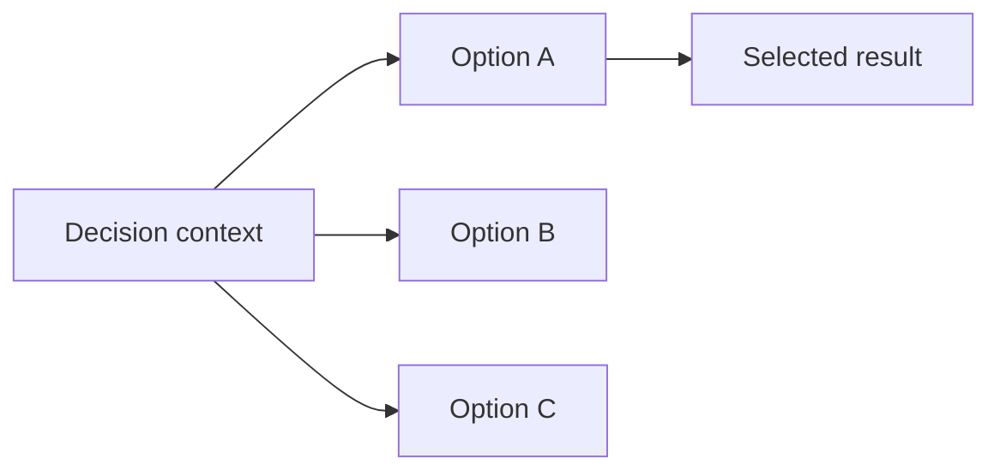

# ADR-{NNNN} — {Decision title}

- **Status:** Proposed | Accepted | Superseded | Deprecated | Rejected
- **Date:** {YYYY-MM-DD}
- **Scope:** {boundary governed by this decision}
- **Relates to:** {ADRs, contracts, or owners}
- **Supersedes:** {record or none}

## Context

{State the constraint or conflict that requires a durable decision. Separate
observed facts from future direction.}

## Decision

{State the selected option and the invariant it creates.}

### Principles

1. {Principled guideline}
2. {Principled guideline}

## Options considered

| Option | Benefits | Costs and risks | Result |
|---|---|---|---|
| {option A} | {benefits} | {trade-offs} | Accepted or rejected |
| {option B} | {benefits} | {trade-offs} | Accepted or rejected |
| {option C} | {benefits} | {trade-offs} | Accepted or rejected |

## Architecture impact

| Area | Change | Owner | Unchanged boundary |
|---|---|---|---|
| {area} | {impact} | {canonical owner} | {what remains outside scope} |

## Consequences

- **Positive:** {benefit}
- **Negative:** {cost or constraint}
- **Risk:** {failure mode and owner}

## State of implementation

| Decision part | Status | Durable evidence |
|---|---|---|
| {part} | Implemented | {source, contract, or runtime owner} |
| {part} | Direction | {tracking owner; do not claim as current behavior} |

Transient command output, dates, and rollout progress belong in the owning
tracker record rather than this ADR.
