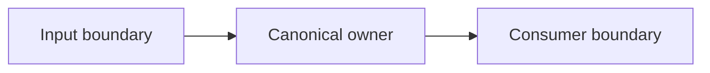
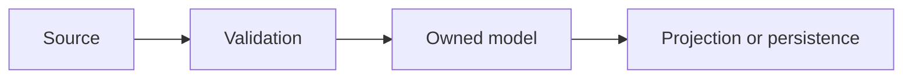

# {Feature} technical design

- **Status:** Draft | Approved | Superseded
- **PRD:** {link}
- **UI specification:** {link or not applicable}
- **Prerequisite ADRs:** {links}
- **Owner:** {name or role}

## Existing system analysis

Describe the current runtime path, its owner, and the integration boundary this
change uses.

### Code inspection evidence

| Path or symbol | Reason inspected | Finding |
|---|---|---|
| {path or symbol} | {question} | {evidence} |

### Implementation path map

| Concern | Existing path | New path | Change |
|---|---|---|---|
| {concern} | {current owner or none} | {planned owner} | {migration or extension} |

## Change impact map

```yaml
change_target: {component or feature}
direct_impact:
  - {file, symbol, or contract}
indirect_impact:
  - {data, timing, or consumer effect}
no_ripple_effect:
  - {explicitly unaffected area}
```

## Delivery approach

- **Shape:** Vertical | Horizontal | Hybrid
- **Required order:** {dependency-ordered sequence}
- **Constraints:** {technical and operational constraints}

### Technical dependencies

| Dependency | Required before | Constraint |
|---|---|---|
| {component, contract, or decision} | {dependent step} | {ordering reason} |

## Architecture



## Data flow



## Interface change matrix

| Existing | New | Conversion required | Compatibility method |
|---|---|---|---|
| {operation} | {operation} | {yes or no} | {complete cutover; no parallel path} |

## Contracts and representation

| Contract | Owner | Input | Output | Validation |
|---|---|---|---|---|
| {contract} | {owner} | {type} | {type} | {boundary rule} |

### Data representation decision

{Explain why the selected representation owns the data and which alternatives
were rejected.}

### Field propagation

| Field | Source | Boundaries crossed | Consumer | Transformation |
|---|---|---|---|---|
| {field} | {owner} | {boundary list} | {consumer} | {rule or none} |

## Integration points

| Integration | Direction | Contract | Failure owner |
|---|---|---|---|
| {system} | {inbound or outbound} | {contract} | {owner} |

## Applicable standards

| Standard | Classification | Required behavior |
|---|---|---|
| {rule, ADR, or convention} | {explicit or implicit} | {constraint on this design} |

## Acceptance criteria

| ID | Verifiable condition | Pass threshold | Evidence surface |
|---|---|---|---|
| DC-001 | {condition} | {binary or numeric threshold} | {runtime or gate} |

## Verification strategy

- **Correctness:** {what correct means and how it is proven}
- **Early proof:** {first real consumer or seam to validate}
- **Early success:** {decisive pass condition}
- **Failure response:** {owner and next action}
- **Final proof:** {integration and regression evidence}

## Agreement checklist

- [ ] Product scope and acceptance criteria agreed
- [ ] Architecture owner agreed
- [ ] Security and privacy boundary agreed
- [ ] Operations and rollout boundary agreed
- [ ] Verification strategy agreed
