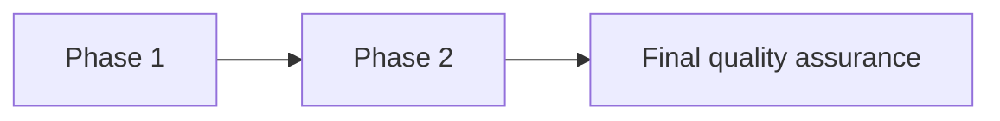
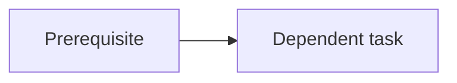

# {Work item} plan

- **Status:** Draft | Approved | Complete | Superseded
- **Design:** {link}
- **ADR:** {link or not applicable}
- **Owner:** {name or role}
- **Tracker:** {Bead or canonical work item}

## Objective

{One outcome the plan delivers.}

## Verification summary

- **Correctness:** {proof method from the design}
- **Early proof:** {first real consumer}
- **Final proof:** {integration boundary}

## Phase structure

## Dependencies

## Schedule and ownership

| Phase | Owner | Estimate | Start condition | Exit condition |
|---|---|---|---|---|
| Phase 1 | {name or role} | {duration} | {prerequisite evidence} | {measurable result} |
| Phase 2 | {name or role} | {duration} | {prerequisite evidence} | {measurable result} |

## Phases

### Phase 1 — {Value unit or foundation}

**Estimate:** {duration}

- [ ] {Task}
  - [ ] {Single nested verification item}

**Exit condition:** {runtime evidence and green scoped gates}

### Phase 2 — {Value unit or integration}

**Estimate:** {duration}

- [ ] {Task}

**Exit condition:** {runtime evidence and green scoped gates}

### Final quality assurance

- [ ] Every acceptance criterion has evidence
- [ ] Integration and end-to-end paths pass
- [ ] Static, test, documentation, and reference gates pass
- [ ] Generated outputs reach a fixed point
- [ ] Superseded paths and unrewired consumers are absent
- [ ] Tracker, branch, review, and integration evidence are current

## Test skeletons

| Level | Planned path | Behavior covered |
|---|---|---|
| Integration | `{path}` | {observable interaction} |
| End to end | `{path}` | {user or system workflow} |

## Progress record

| Date | Phase | Evidence | Decision or blocker |
|---|---|---|---|
| {YYYY-MM-DD} | {phase} | {command and result} | {state} |
