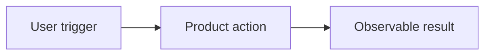
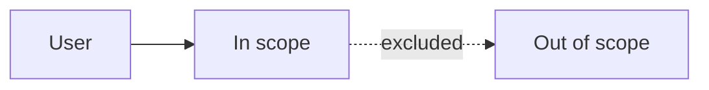

# {Product or feature} requirements

- **Status:** Draft | Approved | Superseded
- **Owner:** {name or role}
- **Decision date:** {YYYY-MM-DD}
- **Target phase:** MVP | Future

## Problem

{Describe the user or business problem without prescribing a technical solution.}

## Goals

- {Measurable outcome}

## Non-goals

- {Explicit boundary}

## Users and use cases

| User | Need | Use case |
|---|---|---|
| {persona} | {need} | {observable workflow} |

## User stories

- As a {user}, I want {capability}, so that {value}.

## Requirements

| ID | Priority | Requirement | Phase |
|---|---|---|---|
| R-001 | Must | {requirement} | MVP |

Use Must, Should, Could, and Won't for priority. Keep future requirements
separate from the MVP.

## Acceptance criteria

| ID | Requirement | Pass condition |
|---|---|---|
| AC-001 | R-001 | {observable, binary condition} |

## Success metrics

| Metric | Numeric target | Measurement method | Review point |
|---|---:|---|---|
| {metric} | {target} | {source and calculation} | {date or event} |

## User journey

## Scope boundary

## Assumptions and risks

| Assumption or risk | Validation or response |
|---|---|
| {item} | {evidence or action} |

## Approval

| Stakeholder | Decision | Date |
|---|---|---|
| {role} | Pending | {YYYY-MM-DD} |
