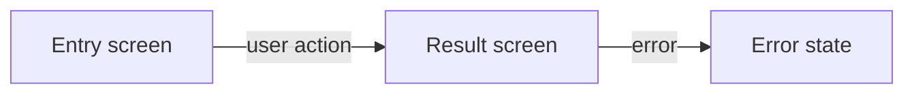
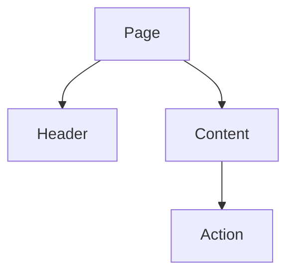

# {Feature} UI specification

- **Status:** Draft | Approved | Superseded
- **PRD:** {link}
- **Owner:** {name or role}

## Screens

| Screen | Purpose | Entry condition | Exit condition |
|---|---|---|---|
| {screen} | {purpose} | {condition} | {condition} |

## Screen transitions

## Component tree

## Component reuse map

| Need | Existing component | Decision | Reason |
|---|---|---|---|
| {need} | {component or none} | {reuse, extend, or new} | {reason} |

## Design tokens

| Concern | Existing token | Decision | Constraint |
|---|---|---|---|
| {color, spacing, type, or motion} | {token or none} | {reuse or introduce} | {measurable rule} |

## State and display matrix

| Component | Default | Loading | Empty | Error | Partial |
|---|---|---|---|---|---|
| {component} | {display} | {display} | {display} | {display} | {display} |

## Interactions

Write behavior in EARS form: When {trigger}, the product shall {observable
response}.

| ID | Trigger | Response | PRD criterion |
|---|---|---|---|
| UI-001 | {trigger} | {response} | AC-001 |

## Acceptance traceability

| PRD criterion | Screen | Component | State | UI criterion |
|---|---|---|---|---|
| AC-001 | {screen} | {component} | {state} | UI-001 |

## Visual acceptance

| State | Golden condition | Layout constraint |
|---|---|---|
| {state} | {observable appearance} | {measurable constraint} |

## Accessibility

- Keyboard order: {expected order}
- Focus behavior: {entry, change, and restore behavior}
- Screen-reader names: {required accessible names}
- Contrast: {standard and target}
- Motion: {reduced-motion behavior}

## Prototype assets

Store supporting prototypes under `docs/ui-spec/assets/{feature}/`. Assets are
examples; this specification and the design document remain authoritative.
